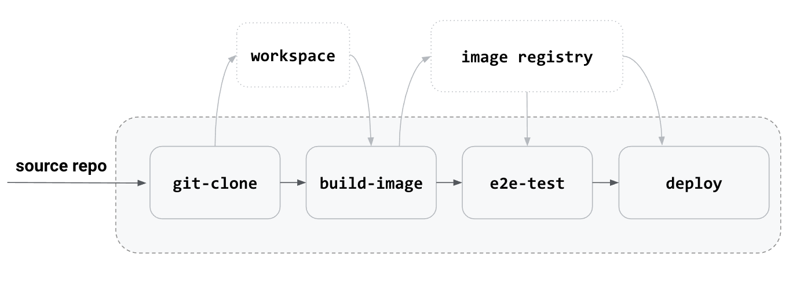
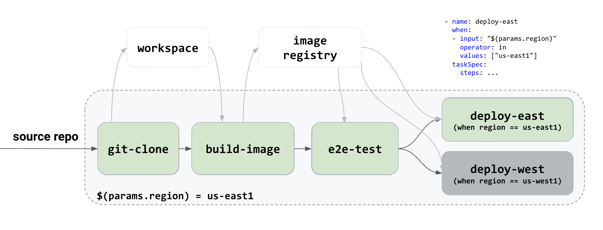
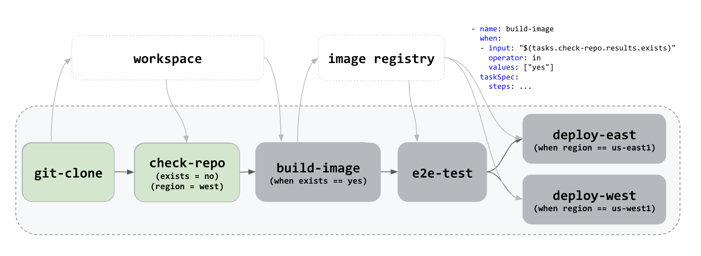
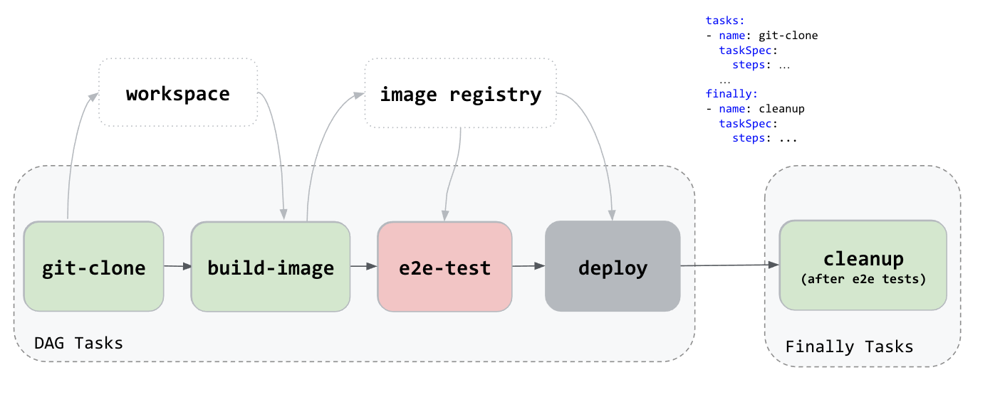

# cdCon2020 - Tekton Pipelines

## Use Case 01: Build-Test-Deploy



## Use Case 02: Build-Test-Deploy in a Region



## Use Case 03: Guarded Build-Test-Deploy



## Use Case 04: Build-Test-Deploy with Cleanup



## Dashboard

Run the following command to install Tekton Dashboard and its dependencies on a Kubernetes Cluster:

```shell script
kubectl apply --filename https://storage.googleapis.com/tekton-releases/dashboard/latest/tekton-dashboard-release.yaml
```

By default, the Dashboard is not exposed outside the cluster.

Use `kubectl port-forward` to access the Dashboard UI depending on your setup described below.

Assuming tekton-pipelines is the install namespace for the Dashboard, run the following command:

```shell script
kubectl --namespace tekton-pipelines port-forward svc/tekton-dashboard 9097:9097
```

Browse [http://localhost:9097](http://localhost:9097) to access your Dashboard.
